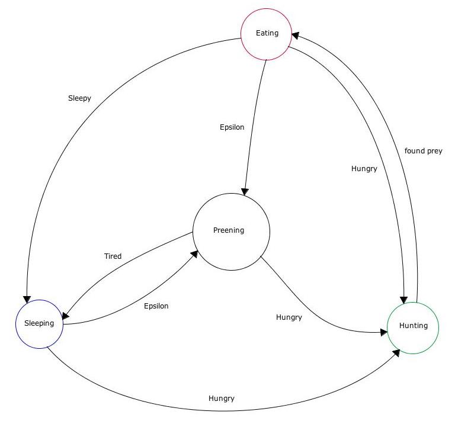

#Exercise

## Regular Expressions
1. Regex for `Antelope Antelopes`
```
/((?:Antelopes*)(?:\sAntelopes*)*)\b/g
```

2. Regex for `goat moat !boat`
```
/([^b][gm]oat)\b/g
```

3. Regex that matches dates in YYYY-MM-DD format. This does not need to 
   verify the date is correct.
```
/([0-9]{4}-[0-9]{2}-[0-9]{2})\b/g
```

## State Machines

1. Character Regex String


2. Lion State Machine

